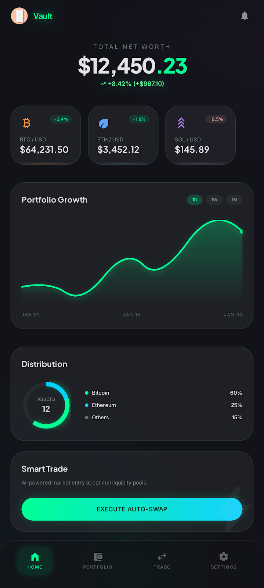

# Vault - Ethereal Ledger

A premium cryptocurrency portfolio tracker built with Flutter. Features a glassmorphic dark UI, real-time price tracking, and interactive charts.




## 🎥 Demo Video

[](https://www.youtube.com/watch?v=YOUR_VIDEO_ID)

Click the image above to watch the demo video on YouTube.

## ✨ Features

- 🎨 **Glassmorphic UI** - Dark ethereal theme with backdrop blur effects
- 📊 **Live Price Ticker** - Real-time BTC, ETH, SOL price tracking
- 📈 **Interactive Charts** - Portfolio growth visualization with touch tooltips
- 🔔 **Auto-refresh** - Automatic data updates every 30 seconds
- 💾 **Local Data** - Works offline with simulated market data
- 🌊 **Smooth Animations** - Shimmer loading states and micro-interactions

## 🚀 Getting Started

### Prerequisites

- Flutter SDK 3.0 or higher
- Dart SDK 3.0 or higher
- Android Studio / VS Code

### Installation

```bash
# Clone the repository
git clone https://github.com/yourusername/vault-crypto-flutter.git

# Navigate to project
cd vault-crypto-flutter

# Install dependencies
flutter pub get

# Run the app
flutter run
